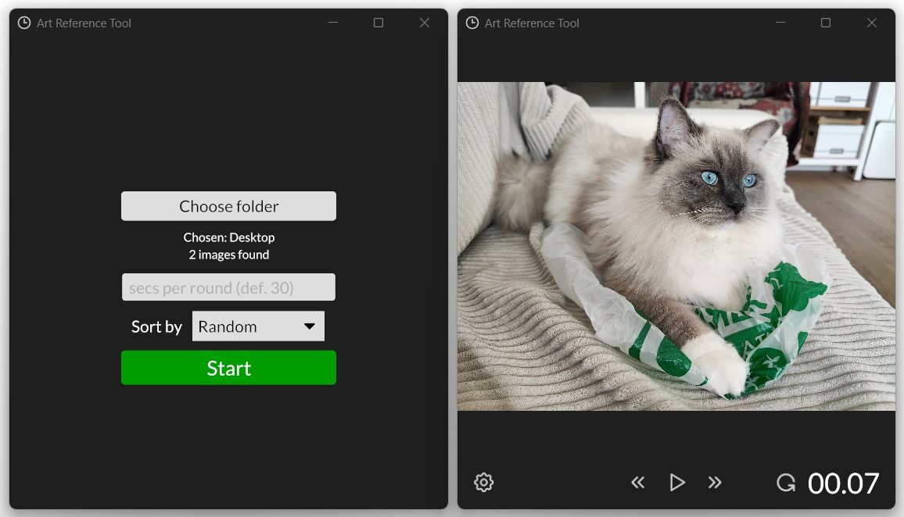

## ART

**A**rt **R**eference **T**ool (**ART**) is tool for drawing from references with time limits. Drawing with time limits is common way to practice gesture drawing.

**ART** interface allows to choose folder with images and to set time for practicing with one reference. Images can be sorted by names or in random order. Timer can be paused and user can skip images or return to previous ones (interface is similar to those used in music players).

Supported image formats: jpeg and png.

## Assets license information

Tabler icons under MIT (available https://github.com/tabler/tabler-icons)